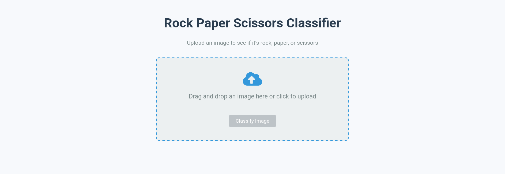
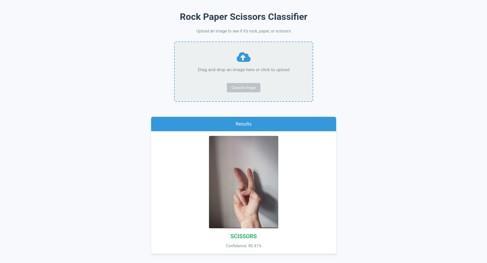

# Rock-Paper-Scissors Classification

A web application that classifies images as rock, paper, or scissors using a machine learning model.

## Building model

[Google Colab Notebook](https://colab.research.google.com/drive/1RAiDqzZs6nr5sd3RExpS3EUqhDu8H58H?usp=sharing)

## Dataset

This project uses the [Rock-Paper-Scissors dataset](https://www.kaggle.com/datasets/alexandredj/rock-paper-scissors-dataset) from Kaggle.

## Prerequisites

- Python 3.11
- TensorFlow 2.x
- Flask
- Pillow (PIL)

## Installation

1. Clone the repository:
   ```bash
   git clone https://github.com/yourusername/rock-paper-scissors-classification.git
   cd rock-paper-scissors-classification
   ```

2. Install Git LFS:
   This repository uses Git Large File Storage (LFS) for the model files.
   - [Install Git LFS](https://git-lfs.com) following the official instructions
   - After installation, set up LFS and pull the model files:
   ```bash
   git lfs install
   git lfs pull
   ```

3. Create and activate a virtual environment (optional but recommended):
   ```bash
   python3 -m venv venv
   source venv/bin/activate  # On Windows, use: venv\Scripts\activate
   ```

4. Install dependencies:
   ```bash
   pip install -r requirements.txt
   ```

5. Create environment variables:
   ```bash
   cp .env.sample .env
   ```
   Then edit the `.env` file with your settings.

6. Make sure the directory structure includes:
   - `static/uploads/` for uploaded images
   - `static/models/` with the trained model file

## How to Run

1. Activate your virtual environment if you're using one:
   ```bash
   source venv/bin/activate  # On Windows, use: venv\Scripts\activate
   ```

2. Start the Flask development server:
   ```bash
   flask run
   ```

3. Open your web browser and navigate to:
   ```
   http://127.0.0.1:5000/
   ```

## Application Preview





## Usage

1. Upload an image of a hand showing either rock, paper, or scissors gesture
2. The application will predict which gesture is shown in the image
3. Results are displayed with the predicted class and confidence score

## Project Structure

- `app.py`: Flask application entry point
- `classifier.py`: Image classification logic
- `static/`: Static files (CSS, JS, models, uploaded images)
- `templates/`: HTML templates
- `requirements.txt`: Project dependencies